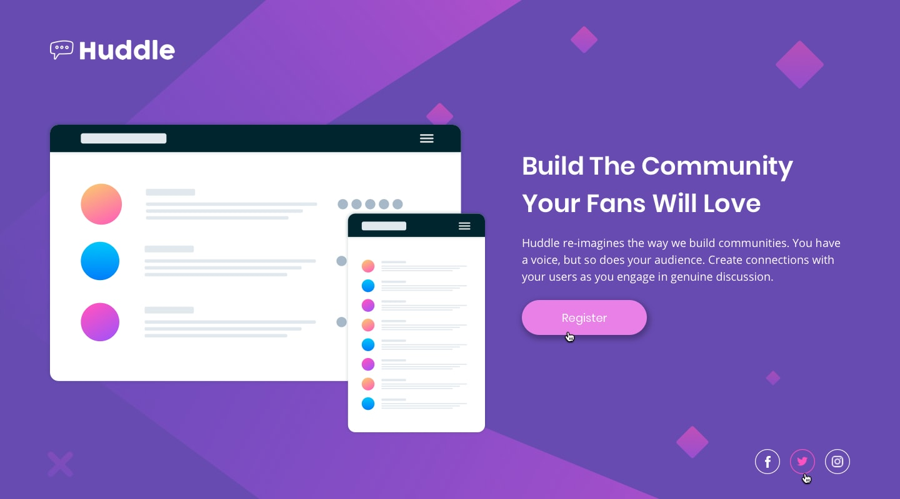

# Desafio do curso Dev-Quest.
## Criando uma landing page do Frontend-Mentor

O desafio foi proposto pelo curso ao final dos módulos de HTML e CSS avançados.
Pude colocar em prática o que aprendi durante esses dois meses fazendo o curso e estudando as linguagens.  
Estou muito feliz com o resultado, pois depois de muito insistir consegui fazer ele ficar responsivo. (Sei que tenho muito a aprender, mas estou muito feliz que em mesmo em pouco tempo estudando consegui chegar nesse resultado) 

### Layout Proposto:
- Desktop

[]

- Estados Ativados

[]

- Mobile

[]

### Como ficou:
[]

## Tecnologias utilizadas:
- HTML
- CSS

## Minhas redes:

 
  
  <a href="https://www.linkedin.com/in/sara-fernandes-3b2aa1224/" target="_blank"></a
